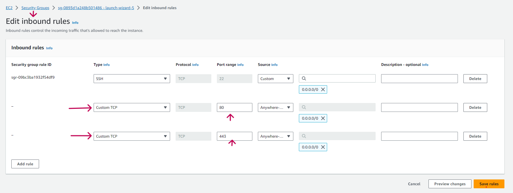

# Setting Up a GitHub Actions Self-Hosted Runner on AWS EC2

## Overview
In this guide, we walk through the process of setting up a self-hosted runner for GitHub Actions on an AWS EC2 instance. This allows for greater flexibility in your CI/CD workflows, enabling you to run tasks on your own infrastructure. The guide is structured into distinct milestones for clarity and ease of follow-through.

---

## Iteration 1: Initial Setup

### Setting up an EC2 instance on AWS

1. **Access AWS Management Console**:
   - Navigate to the AWS Management Console and sign in.

2. **EC2 Dashboard**:
   - Access the EC2 dashboard.
   - Initiate the instance creation process.

3. **Select Amazon Machine Image (AMI)**:
   - Opted for Ubuntu Server.

img 1.3.a
4. **Instance Type Selection**:
   - Chose `t2.micro`.

5. **Instance Configuration**:
   - Ensure the instance is within an internet-accessible VPC.

6. **Storage Configuration**:
   - Default storage of 8 GB.

7. **Instance Tagging**:
   - Tagged with `Name` as `GitHub-SelfHosted-Runner`.

8. **Security Group Configuration**:
   - Created `GitHub-Runner-SG`.
   - **Inbound Rule**
     - SSH access Port 22 to "My IP".
     - HTTP access Port 80 to "Everywhere ".
     - HTTPS access Port 443 to "Everywhere".  

img 1.8.a
   - **Outbound Rule**
     - HTTP access Port 80 to "Everywhere ".
     - HTTP access Port 443 to "Everywhere ".

img 1.8.b
9. **Instance Launch**:
   - Review configurations and launch.

10. **Accessing the EC2 Instance**:
   - Use SSH to access the instance.

11. **Prerequisites Installation**:
   - Update system packages.
   - Install essential tools like `git`.

---

## Iteration 2: Runner Installation and Registration

### Installing and Registering GitHub Actions Self-Hosted Runner

1. **Access Repository Settings in GitHub**:
   - Navigate to the desired GitHub repository.
   - Click on the "Settings" tab.
   - In the left sidebar, click on "Actions".
   - Under the "Self-hosted runners" section, click the "Add runner" button.

img 2.1.a

img 2.1.b

img 2.1.c

2. **Runner OS and Architecture Selection**:
   - Selected "Linux" and "x64" (Since we are using Ubuntu).

img 2.2.a
3. **Runner Download and Configuration**:
   - Execute the GitHub-provided commands for runner setup on the EC2 instance.

img 2.3.a
4. **Starting the Runner**:
   - Start the runner to listen for jobs.
   - `./run.sh`

img 2.4.a
---

## Iteration 3: Runner Configuration for Python Workflow

### Configuring GitHub Actions Self-Hosted Runner for a Python Workflow

1. **Python Version Management with `pyenv`**:
   - Install `pyenv` and add it to `$PATH`.
   - Install Python versions 3.8.12 and 3.9.7.

2. **Workflow Execution**:
   - Trigger the GitHub Actions workflow by pushing to the repository.
   - Observe the workflow execution on the self-hosted runner.

img 3.2.a
---

## Additional Documentation: Security Group Configuration

### Configuring Security Groups for GitHub Actions Communication

1. **Outbound Rules**:
   - Open ports 80 (HTTP) and 443 (HTTPS) for communication with GitHub.

2. **Inbound Rules (Optional)**:
   - Open ports 80 and 443 if there are web services running on the machine.

---

## Conclusion

With this guide, you now have a robust setup of a GitHub Actions self-hosted runner on AWS EC2. This runner is equipped to handle Python-based workflows and can be extended to accommodate other workloads. Always ensure the security of your runner and regularly review its configuration to match the evolving requirements of your projects.
